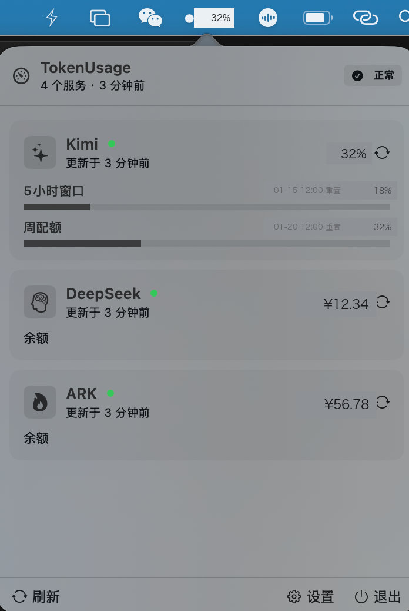

# TokenUsageDisplay

macOS 状态栏小工具：把 Kimi / DeepSeek / 火山方舟 / 智谱 / 阿里云 的额度与余额钉在状态栏上，快用完时一眼可见。



## 个人使用场景

这是作者的自用工具：日常同时使用 Kimi Coding Plan（kimi CLI 编码）、DeepSeek（配在 Claude Code 里）、火山方舟（arkcli 管理）三个服务，经常额度用完了才后知后觉，于是写了它。零配置自动检测就是围绕这三个 CLI 的本地登录态做的——同样配置的用户开箱即用；其他环境未经充分测试，遇到问题欢迎提 Issue / PR。

## 功能

- **状态栏一眼可见**：圆点 + 已用百分比；用量超 80% 变橙、超 95% 变红，健康时保持低调的黑白
- **Kimi Coding Plan**：自动复用 kimi CLI 的本地登录态（OAuth），零配置开箱即用；周配额 / 滚动窗口 / 月配额 / 加油包多窗口分组展示，按重置时间排序；状态栏百分比优先显示"最先咬人"的短窗口
- **DeepSeek**：账户余额监控；可手动填 API Key，也能自动从 Claude Code 的配置里识别
- **火山方舟 ARK**：账户余额；支持手动 AK/SK，也能自动复用 arkcli SSO 登录的 STS 临时凭证（临期自动续签）
- **智谱 GLM Coding Plan**：自动复用 ZCode 的本地登录态，查询周额度 / 滚动窗口配额用量，无需手动填 Key
- **阿里云**：账户余额监控；手动填 RAM 子账号 AccessKey（建议 AliyunBSSReadOnlyAccess 只读权限），调用费用中心 QueryAccountBalance
- **Cmd+Shift+T** 全局热键呼出浮动面板（Carbon 热键，无需辅助功能权限）
- 自动刷新（1 分钟 ~ 1 小时可调）、开机自启动、全中文界面

## 下载

不想自己编译：去 [Releases](https://github.com/strikegoose/TokenUsageDisplay/releases) 下载打包好的 `TokenUsageDisplay.app`（ad-hoc 签名）。解压后拖入"应用程序"，首次打开如被 Gatekeeper 拦截：右键 → 打开，或在 系统设置 → 隐私与安全性 中点"仍要打开"。

## 系统要求

- macOS 14.0+
- Swift 5.9+ 工具链（安装 Xcode Command Line Tools 即可，不需要完整 Xcode）

## 构建与运行

```bash
./build.sh
open TokenUsageDisplay.app
```

构建产物是项目根目录下的 `TokenUsageDisplay.app`（ad-hoc 签名，首次打开如遇 Gatekeeper 提示，在 系统设置 → 隐私与安全性 中允许即可）。纯 SwiftPM，零第三方依赖，没有 Xcode 工程文件。

## 使用

首次启动会自动检测本机已有的登录态（kimi CLI / Claude Code / arkcli），检测到的服务开箱即用。点击状态栏图标 → 设置 → 服务，可手动添加/编辑服务、测试连接。

## 数据安全

- 所有配置与凭证只保存在本机 `~/.config/tokenusage/`，不上传、不进 git
- Kimi 复用 `~/.kimi-code/` 的 OAuth token；火山方舟复用 `~/.arkcli/` 的 STS 临时凭证；智谱复用 `~/.zcode/v2/config.json` 的 API Key——均为本地只读复用
- DeepSeek / 阿里云需手动填 Key（阿里云填 RAM 子账号 AccessKey），以明文文件保存在 `~/.config/tokenusage/keys/`（权限 0600，仅当前用户可读）
- 网络请求只发往各服务官方 API，无任何第三方上报
- README 截图中的余额与用量为演示数据，已打码，不代表真实账户

## License

[MIT](LICENSE)
